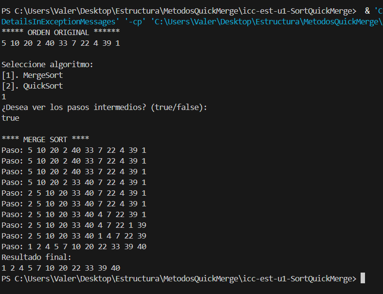
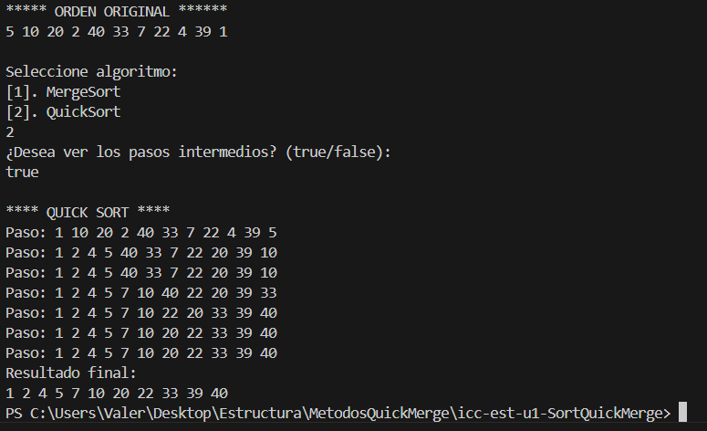

# Estructura de Datos

**Estudiante:** Kelly Valeria Guaman Leon

## Metodo Ordenamiento Merge y Quick

### Practica 5 - 30/OCT

Salida de datos Sort Merge con pasos

Salida de datos Sort Quick con pasos

